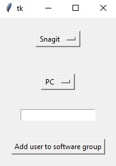

## Projects

This is a page where I'll link to all of my coding projects I've worked on throughout the years.

## Powershell GUI

Use Tkinter and PyInstaller to create an executable GUI that runs PowerShell commands to speed up the process of adding users to AD software groups.
